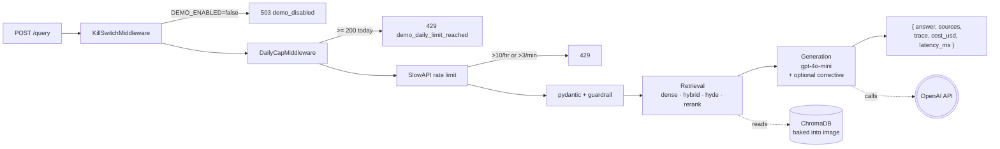

# rag-harness

[](https://github.com/Yashbhadiyadra/rag-harness/actions/workflows/ci.yml)

A reliability-first Retrieval-Augmented Generation (RAG) system over the
[Kubernetes documentation](https://github.com/kubernetes/website). The goal is
not just to answer questions. It is to **measure** answer quality independently
across each failure mode and catch regressions before they ship.

## Why

A RAG pipeline has three independent failure modes. Scoring each one
independently lets you pinpoint exactly what broke, not just that
"something went wrong":

| Stage | Failure | Metric | Threshold |
|---|---|---|---|
| Retrieval | Wrong chunks fetched | Context Recall | ≥ 0.80 |
| Generation | Answer not grounded in context | Faithfulness | ≥ 0.85 |
| Generation | Answer is factually wrong | Correctness | ≥ 0.75 |

The evaluation suite runs against a hand-verified golden set of 30 cases
spanning workloads, networking, storage, scheduling, and cluster operations.
A build fails when any metric drops below its threshold.

## Public demo

A minimal hosted instance runs on Cloud Run with scale-to-zero. Ask a
question, see the answer, sources, per-stage trace, and this query's
cost/latency. Guardrails keep the demo cheap to run:

- Per-IP: **10/hour + 3/minute burst**.
- Global daily cap: **200 requests/day** (00:00 UTC reset).
- Monthly Cloud Billing ceiling: **$10** with 50/90/100% alerts.
- `DEMO_ENABLED=false` env var → instant 503 kill switch.

The live URL is set after the first tagged release; see
[docs/DEMO.md](docs/DEMO.md) for the URL, a tour of the UI, the
guardrail rationale, and how to reproduce the demo locally.

## Retrieval strategies

Five composable retrieval strategies, selectable via `--strategy` or the
`RETRIEVAL_STRATEGY` environment variable:

| Strategy | Composition | Best for |
|---|---|---|
| `dense` | OpenAI embeddings + ChromaDB cosine similarity | Baseline; semantic questions |
| `hybrid` | Dense + BM25 fused with Reciprocal Rank Fusion (k=60) | Mixed queries with exact-term identifiers |
| `hybrid-rerank` | Hybrid retrieval + cross-encoder reranker | Precision-critical use |
| `hyde` | Hypothetical Document Embeddings on top of dense | Query-answer vocabulary mismatch |
| `full` | HyDE ∘ RerankingRetriever ∘ HybridRetriever | Highest quality; highest cost |

Every strategy is documented in [ADR-0006](docs/adr/ADR-0006-hybrid-retrieval-and-reranking.md)
with the tradeoffs and alternatives considered.

### Corrective RAG (opt-in)

An optional critic-and-retry loop wraps any retrieval strategy. The critic scores
each retrieved chunk for relevance and routes the pipeline:

- **Correct**: filter weak chunks, generate the answer
- **Ambiguous**: filter, then generate on the smaller surviving set
- **Incorrect**: reformulate the query and retry once; refuse rather than
  hallucinate if the second attempt also fails

Enable with `--corrective` on the CLI, `corrective: true` in the API body, or
`CORRECTIVE_RAG_ENABLED=true` in `.env`. Details and cost tradeoffs in
[ADR-0007](docs/adr/ADR-0007-corrective-rag.md).

## Setup

**Requirements:** Python 3.12, an OpenAI API key.

```bash
git clone https://github.com/Yashbhadiyadra/rag-harness.git
cd rag-harness

python -m venv .venv && source .venv/bin/activate
pip install -e ".[dev,eval]"

# Optional: cross-encoder reranker (adds ~500 MB with PyTorch)
# pip install -e ".[rerank]"

pre-commit install
cp .env.example .env
# add your OPENAI_API_KEY to .env
```

## Usage

```bash
# Ingest the pinned Kubernetes docs snapshot (clone → chunk → embed → index).
# Re-runs are free: the embedding cache skips previously-seen chunks.
make ingest

# Ask a question with the default (dense) strategy
python -m rag_harness query "How do I configure RBAC in Kubernetes?"

# Same question with hybrid retrieval + cross-encoder reranking
python -m rag_harness query "How do I configure RBAC in Kubernetes?" \
    --strategy hybrid-rerank

# Run the golden eval suite and enforce the quality gate
make eval

# Save per-case scores for regression tracking
python -m rag_harness eval --output results.json    # or .csv

# Run the ablation study across every strategy × mode (see below)
python -m rag_harness ablation
```

### Production hardening

The API service (`POST /query`, `GET /health`, `GET /ready`, `GET /metrics`)
runs on an async request path end-to-end:

- **Retries + timeouts** at the LLM boundary: `AsyncOpenAI` with
  `max_retries=2, timeout=20s`. Total LLM failure returns the honest
  "not enough information" refusal at HTTP 200 rather than a 5xx.
- **Rate limiting**: per-IP via `slowapi`; default sized for the
  public demo at `10/hour;3/minute` (see [ADR-0010](docs/adr/ADR-0010-cloud-run-and-persistence.md));
  override with `API_RATE_LIMIT` for local development.
- **Global daily cap + kill switch**: an in-memory counter (single
  writer under Cloud Run `max-instances=1`) caps the public demo at
  200 requests/day; `DEMO_ENABLED=false` is an emergency kill switch.
  Both middlewares scoped to `/query` so `/health`, `/ready`, and
  `/metrics` stay reachable in every state. See [docs/DEMO.md](docs/DEMO.md).
- **Input caps**: question length ≤ 2000, `top_k` in `[1, 50]`.
- **Prompt-injection screening**: regex hygiene at the boundary
  catches the common patterns. Deliberately narrow, not a full
  guardrails engine.
- **Typed error responses**: every user-facing error path raises a
  `RagHarnessError` subclass mapped to a structured JSON body:
  `{ error_type, message, detail }`.
- **`/health` vs `/ready`**: `/health` is trivial liveness (200 while
  the process is alive); `/ready` checks ChromaDB heartbeat, the
  OpenAI key, and (when needed) the cross-encoder import.
- **Load-check**: `scripts/load_check.py` boots the app in-process
  with mocks and measures async-wiring overhead at 10/25/50/100
  concurrent. First results in `docs/load-check/`.

### PR reliability gate

Every pull request to `main` runs a 5-case reliability subset against the real
LLM (`~$0.02/PR`). The full 30-case suite runs nightly. Both enforce the same
thresholds; the difference is coverage vs cost. PR gate config lives in
`EVAL_PR_SUBSET_IDS`. See `.github/workflows/eval-pr.yml`.

### Ablation study

`python -m rag_harness ablation` sweeps every retrieval strategy in
`{dense, hybrid, hybrid-rerank, hyde, full}` × `{baseline, corrective}` (10
configurations) and emits a comparative markdown table + full CSV. Highlights
the **relevant-but-incorrect** category (confident, on-topic answers that get
the facts wrong) as a dedicated column.

Outputs land in `evals/experiments/ablation_<utc-ts>_<git-sha>.{md,csv}`.
Every run also appends one line per configuration to
`evals/history/runs.jsonl` (append-only) so quality trends are attributable
to commits. See `evals/history/README.md` for the schema.

The LLM judge cache is opt-in on by default for ablation runs, making
subsequent runs against unchanged code near-free.

**Latest results** (2026-07-04, `e148311`, 30 golden cases, `gpt-4o-mini`):

| Strategy | Corrective | Recall | Precision | Faith | Correct | Relevancy | Cost | p50 |
|---|:---:|---:|---:|---:|---:|---:|---:|---:|
| dense | no | 0.77 | 0.91 | 0.87 | 0.74 | 0.80 | $0.009 | 3.0s |
| hybrid | no | 0.78 | 0.86 | 0.86 | 0.76 | 0.87 | $0.010 | 2.5s |
| hybrid-rerank | no | 0.73 | 0.86 | 0.92 | 0.83 | 0.93 | $0.021 | 5.6s |
| **hyde** | no | **0.90** | **0.95** | 0.93 | **0.87** | 0.93 | $0.017 | 6.1s |
| full | no | 0.72 | 0.94 | **0.98** | **0.91** | **1.00** | $0.028 | 10.5s |

Full 10-row table (both corrective modes) and per-case data in
[`evals/experiments/`](evals/experiments/).

Key findings:
- **HyDE dominates on retrieval quality** (recall 0.90, precision 0.95) at
  moderate cost. The vocabulary bridge between short questions and long
  answer chunks matters more than any other single technique on this corpus.
- **Cross-encoder reranking is a precision play, not a recall play.**
  `hybrid-rerank` has the lowest recall but the highest faithfulness. The
  reranker drops relevant chunks alongside noise; survivors are extremely tight.
- **Corrective showed no consistent improvement across strategies** and
  added latency (p50 grows by 1-8s depending on strategy). Single-metric
  moves at n=30 sit within small-sample noise; larger golden sets are
  needed to determine whether corrective actually helps on the weakest
  retrievers.
- **Zero relevant-but-incorrect cases across every configuration.** A
  genuine null result about this corpus. The RBI metric is designed to
  catch confident-sounding hallucination (high relevancy, low correctness);
  on 30 K8s docs cases across 10 configs, it fired zero times. The LLM
  either answers correctly or refuses cleanly on this material, so RBI
  will be a more informative signal on corpora that produce richer
  hallucination patterns.

Serve the API:

```bash
make serve
# POST /query  {"question": "...", "top_k": 5}
# GET  /health
```

Deploy with Docker Compose:

```bash
docker compose up -d
# API on http://localhost:8000
```

## Architecture

Request path, rendered on GitHub via Mermaid:



Data flow (ingest + query), ASCII fallback:

```
┌─────────────────┐     ┌──────────────────┐     ┌─────────────┐
│  K8s docs repo  │────▶│      ingest      │────▶│  ChromaDB   │
│  (pinned SHA)   │     │  load → chunk →  │     │  (dense)    │
└─────────────────┘     │  embed → index   │     └─────────────┘
                        └──────────────────┘            │
                                │                       │
                                ▼                       ▼
                        ┌──────────────────┐     ┌─────────────┐
                        │ embedding cache  │     │  BM25Store  │
                        │    (SQLite)      │     │ (in-memory) │
                        └──────────────────┘     └─────────────┘
                                                        │
              query ────────────────────────────────────┼──────┐
                │                                       │      │
                ▼                                       ▼      ▼
        ┌─────────────┐     ┌──────────────┐     ┌────────────────┐
        │    HyDE     │────▶│  Retriever   │────▶│  Reranker      │
        │ (optional)  │     │ (dense/hybrid│     │  (optional,    │
        └─────────────┘     │  /composed)  │     │  cross-encoder)│
                            └──────────────┘     └────────────────┘
                                                        │
                                                        ▼
                                        ┌────────────────────────────┐
                                        │       generation           │
                                        │       gpt-4o-mini          │
                                        │  + optional corrective     │
                                        │    critic-and-retry loop   │
                                        └────────────────────────────┘
                                                        │
                                                        ▼
                                        ┌────────────────────────────┐
                                        │        evaluation          │
                                        │   context recall +         │
                                        │   context precision +      │
                                        │   faithfulness + correct.  │
                                        │   + answer relevancy       │
                                        └────────────────────────────┘
```

Request path: every `POST /query` traverses this chain before the
handler runs. Order is intentional (ADR-0010): cheapest gate first,
LLM boundary last.

```
POST /query
    │
    ▼
KillSwitchMiddleware       DEMO_ENABLED=false → 503 demo_disabled
    │
    ▼
DailyCapMiddleware         ≥ 200/day globally → 429 demo_daily_limit_reached
    │
    ▼
SlowAPIMiddleware          10/hour + 3/minute per IP → 429
    │
    ▼
pydantic + input guardrail question length, top_k range, prompt-injection screen
    │
    ▼
retrieval → generation     (wrapped in collect_spans + collect_usage)
    │
    ▼
{ answer, sources, trace, cost_usd, latency_ms }
```

The response carries the per-stage trace and this-query cost/latency
so the demo UI at `/` renders them alongside the answer. Full detail
in [`docs/architecture.md`](docs/architecture.md).

## Package layout

```
src/rag_harness/
├── config.py               # Pydantic settings loaded from .env
├── models.py               # Chunk, GoldenCase, EvalResult, EvalSummary
├── logging_setup.py        # Centralised log format + level control
├── ingest/
│   ├── loader.py           # Clone the pinned K8s docs snapshot
│   ├── chunker.py          # Heading-aware markdown chunking
│   ├── embedder.py         # Batched OpenAI embeddings (with cache)
│   ├── embedding_cache.py  # SQLite cache keyed by SHA-256(model+text)
│   └── indexer.py          # Idempotent upsert into ChromaDB
├── retrieval/
│   ├── base.py             # Abstract Retriever interface
│   ├── dense.py            # ChromaDB cosine similarity
│   ├── bm25_store.py       # In-memory BM25Okapi index
│   ├── hybrid.py           # Dense + BM25 with Reciprocal Rank Fusion
│   ├── reranker.py         # Cross-encoder reranking (optional [rerank])
│   ├── hyde.py             # Hypothetical Document Embeddings
│   └── factory.py          # build_retriever(strategy) composes them
├── generation/
│   ├── generator.py        # Context-only prompt, gpt-4o-mini, temp=0
│   ├── critic.py           # Relevance critic (CRAG-style batch scoring)
│   └── corrective.py       # corrective_generate(): retrieve → critique → route
├── evaluation/
│   ├── metrics.py          # context_recall, faithfulness, correctness
│   └── runner.py           # Golden set loader + gate + JSON/CSV export
└── api/
    ├── server.py           # FastAPI: POST /query, GET /health
    └── cli.py              # argparse: ingest, query, eval subcommands
```

## Evaluation

- **Golden set**: 30 hand-verified cases in `evals/golden/`, organised by
  topic (workloads, networking, storage, scheduling, cluster). Version
  controlled and reviewed like code; never auto-generated without review.
- **Reliability gate**: the eval suite fails when any of the three metrics
  drops below its threshold. Treated as a build failure, not a warning.
- **LLM-as-judge**: faithfulness and correctness use `gpt-4o-mini` at
  `temperature=0`; context recall is deterministic set intersection.
- **Nightly runs**: the eval workflow runs on schedule to control cost;
  it is not wired into per-PR CI. Results can be exported to JSON or CSV
  for regression tracking.
- **Integration tests**: end-to-end tests in `tests/integration/` exercise
  the real chunker, indexer, and retriever against a small fixture corpus.
  Run with `pytest -m integration`.

## Configuration

Key environment variables (see `.env.example` for the full list):

| Variable | Purpose | Default |
|---|---|---|
| `OPENAI_API_KEY` | Required for embeddings and generation | — |
| `EMBEDDING_MODEL` | OpenAI embedding model | `text-embedding-3-small` |
| `GENERATION_MODEL` | OpenAI chat model | `gpt-4o-mini` |
| `RETRIEVAL_STRATEGY` | Retrieval strategy (see table above) | `dense` |
| `RETRIEVAL_TOP_K` | Chunks returned per query | `5` |
| `HYBRID_RRF_K` | RRF fusion constant | `60` |
| `CHROMA_DB_PATH` | Vector store location | `./chroma_db` |
| `EMBEDDING_CACHE_PATH` | Cache database location | `./embedding_cache.db` |
| `LOG_LEVEL` | Root logger level | `INFO` |

## Design decisions

All non-trivial decisions are captured as Architecture Decision Records in
[`docs/adr/`](docs/adr/):

- [ADR-0001](docs/adr/ADR-0001-chromadb.md): ChromaDB as vector store
- [ADR-0002](docs/adr/ADR-0002-pinned-corpus.md): Pinned corpus commit
- [ADR-0003](docs/adr/ADR-0003-heading-based-chunking.md): Heading-based chunking
- [ADR-0004](docs/adr/ADR-0004-llm-as-judge-evaluation.md): LLM-as-judge evaluation
- [ADR-0005](docs/adr/ADR-0005-embedding-cache.md): SQLite embedding cache
- [ADR-0006](docs/adr/ADR-0006-hybrid-retrieval-and-reranking.md): Hybrid retrieval, reranking, HyDE
- [ADR-0007](docs/adr/ADR-0007-corrective-rag.md): Corrective RAG critic-and-retry loop
- [ADR-0008](docs/adr/ADR-0008-observability-usage-tracking.md): ContextVar collector for token usage
- [ADR-0009](docs/adr/ADR-0009-tracing-backend.md): Arize Phoenix for per-stage tracing
- [ADR-0010](docs/adr/ADR-0010-cloud-run-and-persistence.md): Cloud Run, scale-to-zero, baked Chroma index, cost guardrails

## Research foundations

The retrieval and evaluation design draws on:

- **RAGAS**: reference-free RAG evaluation metrics
- **Cormack et al. 2009**: Reciprocal Rank Fusion for combining rankers
- **HyDE (Gao et al. 2022)**: Precise Zero-Shot Dense Retrieval without Relevance Labels
- **MS MARCO cross-encoders**: retrieve-then-rerank two-stage pattern
- **CRAG (Yan et al. 2024)**: critic-and-retry loop

## Development

```bash
make check         # ruff lint + ruff format + mypy strict + pytest
make test          # tests only
make lint          # lint only
```

Trunk-based development, conventional commits, all changes gated behind
`make check`. Golden set changes are reviewed like code.

## Attribution

Kubernetes documentation is © The Kubernetes Authors, licensed under
[CC BY 4.0](https://creativecommons.org/licenses/by/4.0/). See
[NOTICE](NOTICE). Project source code is MIT licensed.
