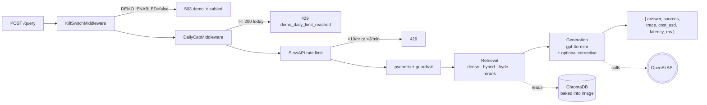

# rag-harness

[](https://github.com/Yashbhadiyadra/rag-harness/actions/workflows/ci.yml)
[](https://rag-harness-277002385573.us-central1.run.app)

A reliability lab for retrieval systems, built over the
[Kubernetes documentation](https://github.com/kubernetes/website). Most RAG
projects stop at a demo. This one treats reliability as the product: it
measures answer quality across each failure mode, **validates the LLM judge
that does the scoring before trusting it**, **red-teams its own corpus** for
prompt injection and data poisoning, and gates every change on the numbers
with bootstrap confidence intervals. Every claim below links to the ADR and
the measured result behind it. The Kubernetes docs are the flagship corpus,
but ingestion is corpus-agnostic: point `CORPUS_*` at any markdown docs repo
and the same reliability machinery applies
([ADR-0019](docs/adr/ADR-0019-bring-your-own-corpus.md)).

## Reliability at a glance

Every number here is produced by a command in this repo and recorded under
`evals/`. Measured on the 160-case single-hop golden set unless noted.

| What | Result | Command |
|---|---|---|
| Answer quality (production `dense` config) | recall 0.95, faithfulness 0.94, correctness 0.92, 0% relevant-but-incorrect | `rag-harness eval` |
| Judge trustworthiness | Cohen's kappa 0.875 (raw agreement 0.938 overstates it by 6.3 points), 0 false-rejects | `rag-harness judge-audit --kappa` |
| Judge fragility (honest) | 10-13% of gate verdicts flip on meaning-preserving formatting near the threshold; padding is penalized | `rag-harness judge-audit` |
| Refusal / negative rejection | 100% abstention on out-of-corpus questions | `rag-harness abstention` |
| Prompt injection (OWASP LLM01) | 100% resistance to direct-override and forged-system; 17% on compliance-appendix (documented survivor) | `rag-harness security-eval` |
| Data poisoning (OWASP LLM04) | corpus pinning is the real defense: a context-faithful model repeats a planted lie by design | `rag-harness security-eval` |
| Citation integrity | 86% of cited passages actually support their sentence | `rag-harness citation-eval` |
| Claim-level groundedness (168 cases) | 0.961 across 465 atomic claims; 1.7% ungrounded-or-contradicted, named per claim | `rag-harness claim-eval` |
| Multi-hop (8-case slice) | query decomposition lifts correctness from 0.59 to 0.73 vs dense | `rag-harness ablation` |
| One-command reliability audit | every probe above rolled into one graded, shareable report | `rag-harness audit` |

Cost is about $0.09 per full eval run at p50 latency around 4.4s per query. The
heavy `full` pipeline underperforms on this factoid corpus (0.87 correctness)
and is deliberately not the gated config: measured, not assumed. Run the whole
showcase end to end with `scripts/demo_reel.sh`.

## Why

A RAG pipeline has three independent failure modes. Scoring each one
independently lets you pinpoint exactly what broke, not just that
"something went wrong":

| Stage | Failure | Metric | Threshold |
|---|---|---|---|
| Retrieval | Wrong chunks fetched | Context Recall | ≥ 0.85 |
| Generation | Answer not grounded in context | Faithfulness | ≥ 0.85 |
| Generation | Answer is factually wrong | Correctness | ≥ 0.82 |

The evaluation suite runs against a hand-verified golden set of 160 single-hop
cases spanning cluster, networking, rbac, scheduling, storage, and workloads
topics, plus dedicated unanswerable (refusal-path) and version-sensitive
categories, and an 8-case multi-hop slice (168 reviewed cases in total). The
headline quality numbers are on the 160 single-hop cases; the multi-hop slice
is scored separately. Thresholds are recalibrated from the ablation to sit below the
production config's bootstrap CI lower bounds (see `config.py`). A build
fails when any gated metric drops below its threshold.

## What's measured

Reliability is measured in four layers, each with real numbers and honest
limits. Run any of them and the result lands in `evals/experiments/` and on
the metrics page.

- **Answer quality** - context recall, precision, faithfulness, correctness,
  and answer relevancy, scored per failure mode by an LLM judge, with an
  opt-in corrective-retry loop and bootstrap 95% confidence intervals on every
  comparison ([ADR-0011](docs/adr/ADR-0011-statistical-significance.md)). The
  same run also reports negative rejection - the fraction of genuinely
  unanswerable golden cases the system refused instead of improvising - as a
  headline number alongside quality.
  `python -m rag_harness ablation`
- **Judge reliability** - the judge is validated before its scores are
  trusted. A three-probe audit (calibration on right answers, near-gate noise,
  wrong-answer discrimination) plus verbosity, format, scale, and test-retest
  stability checks, and a reliability-vs-cost selection matrix across judge
  models ([ADR-0014](docs/adr/ADR-0014-judge-reliability-audit.md)). Raw
  agreement is never reported; chance-corrected kappa is.
  `python -m rag_harness judge-audit`
- **Security and robustness** - injection resistance against poisoned context
  (OWASP LLM01), counterfactual and noise robustness, and negative rejection
  (does it refuse when it should?). The generation prompt is hardened and the
  before/after delta measured
  ([ADR-0015](docs/adr/ADR-0015-retrieved-context-injection-hardening.md)).
  `python -m rag_harness security-eval`
- **Attribution** - chunk-level inline citations tied to the exact passage
  behind each claim, plus a citation-accuracy metric that checks each cited
  passage actually supports its sentence
  ([ADR-0016](docs/adr/ADR-0016-chunk-level-citations.md)).
  `python -m rag_harness citation-eval`

## Public demo

**Live:** https://rag-harness-277002385573.us-central1.run.app - open it and
ask a Kubernetes question (e.g. "What is a Pod?"), or run it locally with
`make serve`. The service runs on Cloud Run with scale-to-zero. The current
instance was deployed by building the image with Cloud Build and applying
`deploy/cloud-run.yaml`; the automated release-on-tag pipeline (build, full
eval-gate, deploy, smoke-test) is scaffolded in
`.github/workflows/release.yml` but not yet wired to a deploy identity. The
demo runs auth-off, protected by three independent guardrails:

- Per-IP: **10/hour + 3/minute burst**.
- Global daily cap: **200 requests/day** (00:00 UTC reset).
- Monthly Cloud Billing ceiling: **$10** with 50/90/100% alerts.
- `DEMO_ENABLED=false` env var → instant 503 kill switch.

The live URL is set after the first tagged release; see
[docs/DEMO.md](docs/DEMO.md) for the URL, a tour of the UI, the
guardrail rationale, and how to reproduce the demo locally.

## Retrieval strategies

Five composable retrieval strategies, selectable via `--strategy` or the
`RETRIEVAL_STRATEGY` environment variable:

| Strategy | Composition | Best for |
|---|---|---|
| `dense` | OpenAI embeddings + ChromaDB cosine similarity | Baseline; semantic questions |
| `hybrid` | Dense + BM25 fused with Reciprocal Rank Fusion (k=60) | Mixed queries with exact-term identifiers |
| `hybrid-rerank` | Hybrid retrieval + cross-encoder reranker | Precision-critical use |
| `hyde` | Hypothetical Document Embeddings on top of dense | Query-answer vocabulary mismatch |
| `full` | HyDE ∘ RerankingRetriever ∘ HybridRetriever | Highest quality; highest cost |

Every strategy is documented in [ADR-0006](docs/adr/ADR-0006-hybrid-retrieval-and-reranking.md)
with the tradeoffs and alternatives considered.

### Corrective RAG (opt-in)

An optional critic-and-retry loop wraps any retrieval strategy. The critic scores
each retrieved chunk for relevance and routes the pipeline:

- **Correct**: filter weak chunks, generate the answer
- **Ambiguous**: filter, then generate on the smaller surviving set
- **Incorrect**: reformulate the query and retry once; refuse rather than
  hallucinate if the second attempt also fails

Enable with `--corrective` on the CLI, `corrective: true` in the API body, or
`CORRECTIVE_RAG_ENABLED=true` in `.env`. Details and cost tradeoffs in
[ADR-0007](docs/adr/ADR-0007-corrective-rag.md).

## Setup

**Requirements:** Python 3.12, an OpenAI API key.

```bash
git clone https://github.com/Yashbhadiyadra/rag-harness.git
cd rag-harness

python -m venv .venv && source .venv/bin/activate
pip install -e ".[dev,eval]"

# Optional: cross-encoder reranker (adds ~500 MB with PyTorch)
# pip install -e ".[rerank]"

pre-commit install
cp .env.example .env
# add your OPENAI_API_KEY to .env
```

## Usage

```bash
# Ingest the pinned Kubernetes docs snapshot (clone → chunk → embed → index).
# Re-runs are free: the embedding cache skips previously-seen chunks.
make ingest

# Ask a question with the default (dense) strategy
python -m rag_harness query "How do I configure RBAC in Kubernetes?"

# Same question with hybrid retrieval + cross-encoder reranking
python -m rag_harness query "How do I configure RBAC in Kubernetes?" \
    --strategy hybrid-rerank

# Run the golden eval suite and enforce the quality gate
make eval

# Save per-case scores for regression tracking
python -m rag_harness eval --output results.json    # or .csv

# Run the ablation study across every strategy × mode (see below)
python -m rag_harness ablation
```

### Production hardening

The API service (`POST /query`, `GET /health`, `GET /ready`, `GET /metrics`)
runs on an async request path end-to-end:

- **Retries + timeouts** at the LLM boundary: `AsyncOpenAI` with
  `max_retries=2, timeout=20s`. Total LLM failure returns the honest
  "not enough information" refusal at HTTP 200 rather than a 5xx.
- **Rate limiting**: per-IP via `slowapi`; default sized for the
  public demo at `10/hour;3/minute` (see [ADR-0010](docs/adr/ADR-0010-cloud-run-and-persistence.md));
  override with `API_RATE_LIMIT` for local development.
- **Global daily cap + kill switch**: an in-memory counter (single
  writer under Cloud Run `max-instances=1`) caps the public demo at
  200 requests/day; `DEMO_ENABLED=false` is an emergency kill switch.
  Both middlewares scoped to `/query` so `/health`, `/ready`, and
  `/metrics` stay reachable in every state. See [docs/DEMO.md](docs/DEMO.md).
- **Input caps**: question length ≤ 2000, `top_k` in `[1, 50]`.
- **Prompt-injection screening**: regex hygiene at the boundary
  catches the common patterns. Deliberately narrow, not a full
  guardrails engine.
- **Typed error responses**: every user-facing error path raises a
  `RagHarnessError` subclass mapped to a structured JSON body:
  `{ error_type, message, detail }`.
- **`/health` vs `/ready`**: `/health` is trivial liveness (200 while
  the process is alive); `/ready` checks ChromaDB heartbeat, the
  OpenAI key, and (when needed) the cross-encoder import.
- **Load-check**: `scripts/load_check.py` boots the app in-process
  with mocks and measures async-wiring overhead at 10/25/50/100
  concurrent. First results in `docs/load-check/`.

### PR reliability gate

Every pull request to `main` runs a 5-case reliability subset against the real
LLM (`~$0.02/PR`). The full 30-case suite runs nightly. Both enforce the same
thresholds; the difference is coverage vs cost. PR gate config lives in
`EVAL_PR_SUBSET_IDS`. See `.github/workflows/eval-pr.yml`.

### Ablation study

`python -m rag_harness ablation` sweeps every retrieval strategy in
`{dense, hybrid, hybrid-rerank, hyde, full, decompose}` × `{baseline,
corrective}` (12 configurations) and emits a comparative markdown table +
full CSV. Highlights the **relevant-but-incorrect** category (confident,
on-topic answers that get the facts wrong) as a dedicated column.

Outputs land in `evals/experiments/ablation_<utc-ts>_<git-sha>.{md,csv}`.
Every run also appends one line per configuration to
`evals/history/runs.jsonl` (append-only) so quality trends are attributable
to commits. See `evals/history/README.md` for the schema.

The LLM judge cache is opt-in on by default for ablation runs, making
subsequent runs against unchanged code near-free.

**Latest results** (2026-07-14, `164ff8c`, 160 golden cases, `gpt-4o-mini`,
baseline mode):

| Strategy | Corrective | Recall | Precision | Faith | Correct | Relevancy | Cost | p50 |
|---|:---:|---:|---:|---:|---:|---:|---:|---:|
| dense | no | 0.95 | 0.81 | **0.94** | 0.92 | 0.81 | $0.094 | 4.4s |
| hybrid | no | 0.94 | 0.80 | 0.91 | 0.93 | 0.82 | $0.098 | 3.7s |
| hybrid-rerank | no | 0.93 | 0.80 | 0.91 | 0.92 | 0.82 | $0.105 | 4.6s |
| hyde | no | 0.94 | 0.81 | 0.92 | 0.92 | 0.81 | $0.113 | 6.0s |
| full | no | 0.88 | 0.76 | 0.87 | 0.87 | 0.78 | $0.137 | 8.2s |
| **decompose** | no | **0.96** | 0.80 | 0.89 | **0.93** | **0.83** | $0.120 | 4.3s |

Full 12-row table (both corrective modes), bootstrap 95% CIs, and per-case
data in [`evals/experiments/`](evals/experiments/) and the metrics page.

Key findings (this table reverses the earlier 30-case result, which is the
point of re-running on a larger, more varied set):
- **Simplicity wins on this factoid-heavy set.** `dense`, `hybrid`, and
  `decompose` lead on correctness (0.92-0.93). The expanded golden set adds
  many precise factoids, version-sensitive facts, and refusals where exact
  retrieval beats query rewriting.
- **The heavy `full` pipeline is now the worst and most expensive** (correct
  0.87, cost $0.137). Stacking HyDE hypothesis generation on top of
  reranking over-transforms short precise queries and hurts retrieval. On
  the old 30-case set `full`/`hyde` led; the larger set inverts that.
- **Query decomposition tops recall (0.96) and ties for best correctness
  (0.93)** at ~1.3x dense cost, without regressing on single-hop questions.
- **Corrective still shows no consistent gain** and adds latency, so it
  stays opt-in.
- **Relevant-but-incorrect stays near zero** (0-2 cases per config, <=1%
  across all 12). The model answers correctly or refuses cleanly on this
  material; RBI will be a more informative signal on corpora with richer
  hallucination patterns.

Serve the API:

```bash
make serve
# POST /query  {"question": "...", "top_k": 5}
# GET  /health
```

Deploy with Docker Compose:

```bash
docker compose up -d
# API on http://localhost:8000
```

## Architecture

Request path, rendered on GitHub via Mermaid:



Data flow (ingest + query), ASCII fallback:

```
┌─────────────────┐     ┌──────────────────┐     ┌─────────────┐
│  K8s docs repo  │────▶│      ingest      │────▶│  ChromaDB   │
│  (pinned SHA)   │     │  load → chunk →  │     │  (dense)    │
└─────────────────┘     │  embed → index   │     └─────────────┘
                        └──────────────────┘            │
                                │                       │
                                ▼                       ▼
                        ┌──────────────────┐     ┌─────────────┐
                        │ embedding cache  │     │  BM25Store  │
                        │    (SQLite)      │     │ (in-memory) │
                        └──────────────────┘     └─────────────┘
                                                        │
              query ────────────────────────────────────┼──────┐
                │                                       │      │
                ▼                                       ▼      ▼
        ┌─────────────┐     ┌──────────────┐     ┌────────────────┐
        │    HyDE     │────▶│  Retriever   │────▶│  Reranker      │
        │ (optional)  │     │ (dense/hybrid│     │  (optional,    │
        └─────────────┘     │  /composed)  │     │  cross-encoder)│
                            └──────────────┘     └────────────────┘
                                                        │
                                                        ▼
                                        ┌────────────────────────────┐
                                        │       generation           │
                                        │       gpt-4o-mini          │
                                        │  + optional corrective     │
                                        │    critic-and-retry loop   │
                                        └────────────────────────────┘
                                                        │
                                                        ▼
                                        ┌────────────────────────────┐
                                        │        evaluation          │
                                        │   context recall +         │
                                        │   context precision +      │
                                        │   faithfulness + correct.  │
                                        │   + answer relevancy       │
                                        └────────────────────────────┘
```

Request path: every `POST /query` traverses this chain before the
handler runs. Order is intentional (ADR-0010): cheapest gate first,
LLM boundary last.

```
POST /query
    │
    ▼
KillSwitchMiddleware       DEMO_ENABLED=false → 503 demo_disabled
    │
    ▼
DailyCapMiddleware         ≥ 200/day globally → 429 demo_daily_limit_reached
    │
    ▼
SlowAPIMiddleware          10/hour + 3/minute per IP → 429
    │
    ▼
pydantic + input guardrail question length, top_k range, prompt-injection screen
    │
    ▼
retrieval → generation     (wrapped in collect_spans + collect_usage)
    │
    ▼
{ answer, sources, trace, cost_usd, latency_ms }
```

The response carries the per-stage trace and this-query cost/latency
so the demo UI at `/` renders them alongside the answer. Full detail
in [`docs/architecture.md`](docs/architecture.md).

## Package layout

```
src/rag_harness/
├── config.py               # Pydantic settings loaded from .env
├── models.py               # Chunk, GoldenCase, EvalResult, EvalSummary
├── logging_setup.py        # Centralised log format + level control
├── ingest/
│   ├── loader.py           # Clone the pinned K8s docs snapshot
│   ├── chunker.py          # Heading-aware markdown chunking
│   ├── embedder.py         # Batched OpenAI embeddings (with cache)
│   ├── embedding_cache.py  # SQLite cache keyed by SHA-256(model+text)
│   └── indexer.py          # Idempotent upsert into ChromaDB
├── retrieval/
│   ├── base.py             # Abstract Retriever interface
│   ├── dense.py            # ChromaDB cosine similarity
│   ├── bm25_store.py       # In-memory BM25Okapi index
│   ├── hybrid.py           # Dense + BM25 with Reciprocal Rank Fusion
│   ├── reranker.py         # Cross-encoder reranking (optional [rerank])
│   ├── hyde.py             # Hypothetical Document Embeddings
│   └── factory.py          # build_retriever(strategy) composes them
├── generation/
│   ├── generator.py        # Context-only prompt, gpt-4o-mini, temp=0
│   ├── critic.py           # Relevance critic (CRAG-style batch scoring)
│   └── corrective.py       # corrective_generate(): retrieve → critique → route
├── evaluation/
│   ├── metrics.py          # context_recall, faithfulness, correctness
│   └── runner.py           # Golden set loader + gate + JSON/CSV export
└── api/
    ├── server.py           # FastAPI: POST /query, GET /health
    └── cli.py              # argparse: ingest, query, eval subcommands
```

## Evaluation

- **Golden set**: 30 hand-verified cases in `evals/golden/`, organised by
  topic (workloads, networking, storage, scheduling, cluster). Version
  controlled and reviewed like code; never auto-generated without review.
- **Reliability gate**: the eval suite fails when any of the three metrics
  drops below its threshold. Treated as a build failure, not a warning.
- **LLM-as-judge**: faithfulness and correctness use `gpt-4o-mini` at
  `temperature=0`; context recall is deterministic set intersection.
- **Nightly runs**: the eval workflow runs on schedule to control cost;
  it is not wired into per-PR CI. Results can be exported to JSON or CSV
  for regression tracking.
- **Integration tests**: end-to-end tests in `tests/integration/` exercise
  the real chunker, indexer, and retriever against a small fixture corpus.
  Run with `pytest -m integration`.

## Configuration

Key environment variables (see `.env.example` for the full list):

| Variable | Purpose | Default |
|---|---|---|
| `OPENAI_API_KEY` | Required for embeddings and generation | - |
| `EMBEDDING_MODEL` | OpenAI embedding model | `text-embedding-3-small` |
| `GENERATION_MODEL` | OpenAI chat model | `gpt-4o-mini` |
| `RETRIEVAL_STRATEGY` | Retrieval strategy (see table above) | `dense` |
| `RETRIEVAL_TOP_K` | Chunks returned per query | `5` |
| `HYBRID_RRF_K` | RRF fusion constant | `60` |
| `CHROMA_DB_PATH` | Vector store location | `./chroma_db` |
| `EMBEDDING_CACHE_PATH` | Cache database location | `./embedding_cache.db` |
| `LOG_LEVEL` | Root logger level | `INFO` |

## Design decisions

All non-trivial decisions are captured as Architecture Decision Records in
[`docs/adr/`](docs/adr/):

- [ADR-0001](docs/adr/ADR-0001-chromadb.md): ChromaDB as vector store
- [ADR-0002](docs/adr/ADR-0002-pinned-corpus.md): Pinned corpus commit
- [ADR-0003](docs/adr/ADR-0003-heading-based-chunking.md): Heading-based chunking
- [ADR-0004](docs/adr/ADR-0004-llm-as-judge-evaluation.md): LLM-as-judge evaluation
- [ADR-0005](docs/adr/ADR-0005-embedding-cache.md): SQLite embedding cache
- [ADR-0006](docs/adr/ADR-0006-hybrid-retrieval-and-reranking.md): Hybrid retrieval, reranking, HyDE
- [ADR-0007](docs/adr/ADR-0007-corrective-rag.md): Corrective RAG critic-and-retry loop
- [ADR-0008](docs/adr/ADR-0008-observability-usage-tracking.md): ContextVar collector for token usage
- [ADR-0009](docs/adr/ADR-0009-tracing-backend.md): Arize Phoenix for per-stage tracing
- [ADR-0010](docs/adr/ADR-0010-cloud-run-and-persistence.md): Cloud Run, scale-to-zero, baked Chroma index, cost guardrails
- [ADR-0011](docs/adr/ADR-0011-statistical-significance.md): Statistical significance for ablation comparisons
- [ADR-0012](docs/adr/ADR-0012-golden-set-expansion.md): Golden-set expansion pipeline
- [ADR-0013](docs/adr/ADR-0013-api-security-hardening.md): API security hardening baseline
- [ADR-0014](docs/adr/ADR-0014-judge-reliability-audit.md): Judge reliability audit
- [ADR-0015](docs/adr/ADR-0015-retrieved-context-injection-hardening.md): Retrieved-context injection hardening
- [ADR-0016](docs/adr/ADR-0016-chunk-level-citations.md): Chunk-level inline citations
- [ADR-0017](docs/adr/ADR-0017-query-decomposition.md): Query decomposition retrieval strategy
- [ADR-0018](docs/adr/ADR-0018-otel-genai-conventions.md): OpenTelemetry GenAI semantic conventions
- [ADR-0019](docs/adr/ADR-0019-bring-your-own-corpus.md): Bring-your-own-corpus ingestion
- [ADR-0020](docs/adr/ADR-0020-closed-loop-eval.md): Closed-loop eval (production traces to review queue)
- [ADR-0021](docs/adr/ADR-0021-mcp-server.md): MCP server (agent tools, secure by default)
- [ADR-0022](docs/adr/ADR-0022-multilingual-support.md): Multilingual support (design)
- [ADR-0023](docs/adr/ADR-0023-api-authentication.md): API-key authentication
- [ADR-0024](docs/adr/ADR-0024-horizontal-scale.md): Horizontal scale via shared Redis state
- [ADR-0025](docs/adr/ADR-0025-multi-tenancy.md): Multi-tenant corpus isolation
- [ADR-0026](docs/adr/ADR-0026-secrets-management.md): Secrets management posture
- [ADR-0027](docs/adr/ADR-0027-claim-level-groundedness.md): Claim-level groundedness (four-way typology)
- [ADR-0028](docs/adr/ADR-0028-http-mcp-server.md): Stateless HTTP MCP server
- [ADR-0029](docs/adr/ADR-0029-factuality-gateway.md): Factuality gateway (claim-level verify-and-regenerate)
- [ADR-0030](docs/adr/ADR-0030-open-model-groundedness-detector.md): Open-model groundedness detector (measured negative result)

## Research foundations

The retrieval and evaluation design draws on:

- **RAGAS**: reference-free RAG evaluation metrics
- **Cormack et al. 2009**: Reciprocal Rank Fusion for combining rankers
- **HyDE (Gao et al. 2022)**: Precise Zero-Shot Dense Retrieval without Relevance Labels
- **MS MARCO cross-encoders**: retrieve-then-rerank two-stage pattern
- **CRAG (Yan et al. 2024)**: critic-and-retry loop

## Security

Secure by default: the service ships with its protections on, and
weakening any of them requires an explicit opt-out in configuration.
See [ADR-0013](docs/adr/ADR-0013-api-security-hardening.md).

- **Data boundary.** The only data that leaves the service is the user
  question plus the retrieved documentation chunks, sent to the LLM
  API to generate the answer. No accounts, no analytics, no other
  third parties.
- **Logging.** Query text is never logged in full; warning-path log
  events carry at most a 60-character prefix. `/metrics` exposes
  aggregate counters only (request totals, token counts, cost sums).
- **Abuse protection.** Per-IP rate limiting (`API_RATE_LIMIT`), a
  global daily request cap (`DEMO_DAILY_REQUEST_CAP`), an emergency
  kill switch (`DEMO_ENABLED=false`), bounded question length, and
  capped `top_k`.
- **Authentication.** Optional API-key auth (`API_AUTH_ENABLED`, off
  for the public demo). When on, `/query` requires
  `Authorization: Bearer <key>` and the rate limiter meters per key;
  `/health`, `/ready`, and `/metrics` stay open for probes. Keys are
  stored only as SHA-256 digests (`API_KEYS`), never plaintext, and
  enabling auth with no keys fails at startup. The bundled demo UI is
  the unauthenticated public surface by design; authenticated access is
  via API clients. See
  [ADR-0023](docs/adr/ADR-0023-api-authentication.md).
- **Injection screening.** Requests matching common prompt-injection
  patterns are rejected at the boundary; generation runs with a
  context-only prompt. This is a hygiene layer, not a guarantee - see
  `api/guardrails.py` for the honest scope.
- **Response headers.** Strict same-origin CSP, `nosniff`,
  `X-Frame-Options: DENY`, HSTS, and `Referrer-Policy: no-referrer`
  on every response.
- **Supply chain.** Dependencies are scanned with `pip-audit` in CI;
  the documentation corpus is pinned to an immutable commit whose SHA
  is verified at ingest and recorded per chunk.
- **Secrets.** In production the `OPENAI_API_KEY` is injected from
  Secret Manager at runtime and is never baked into the image (`.env`
  is docker-ignored, the Dockerfile hardcodes no key, and a guard test
  enforces this). Locally the key comes from the git-ignored `.env`;
  `.env.example` documents every variable with placeholders. See
  [ADR-0026](docs/adr/ADR-0026-secrets-management.md).

## Development

```bash
make check         # ruff lint + ruff format + mypy strict + pytest
make test          # tests only
make lint          # lint only
```

Trunk-based development, conventional commits, all changes gated behind
`make check`. Golden set changes are reviewed like code.

## Attribution

Kubernetes documentation is © The Kubernetes Authors, licensed under
[CC BY 4.0](https://creativecommons.org/licenses/by/4.0/). See
[NOTICE](NOTICE). Project source code is MIT licensed.
